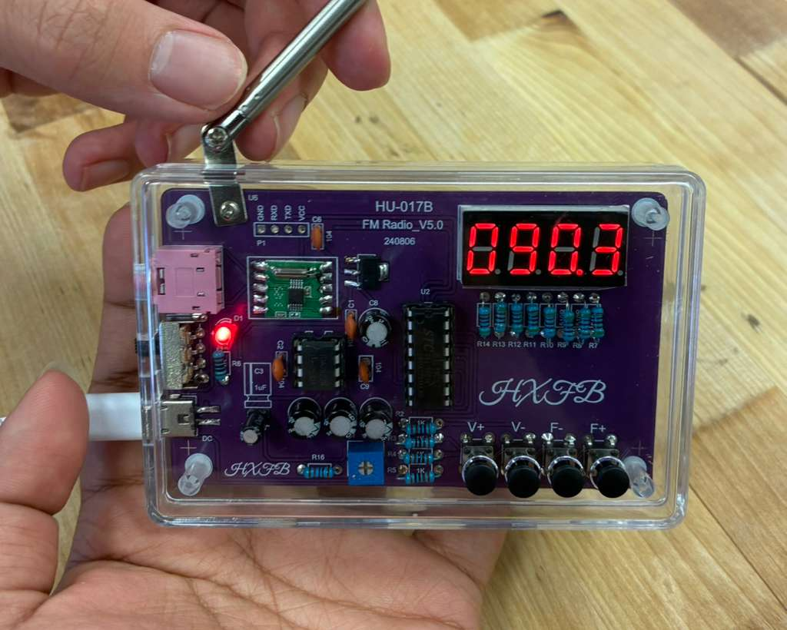

# Entries

## Entry 1
Today I mostly soldered all of the components on the PCB, with 3/4 components left. It's also a fairly more complicated project than the last PCBs I did with more components like ceramic capacitors, regular ones, snap on components, etc. 

## Entry 2
Done with soldering the pcb, its up and working now! Good thing I didn't run into any major issue that I had to troubleshoot with. So pretty much it was a lot easier than expected. 

